<!-- SEO Meta -->
<!--
  Title: Panth Crosslinks — Automatic Internal Linking for Magento 2 (Hyva + Luma)
  Description: Turn keywords in Magento 2 product, category, and CMS content into internal anchor links automatically. Admin grid for keyword-to-URL rules, reference by custom URL / product SKU / category ID, per-page and per-keyword limits, time-based activation, excluded-tag safety, nofollow support. Works identically on Hyva and Luma. Extracted from Panth_AdvancedSEO for standalone installation.
  Keywords: magento 2 internal linking, magento 2 crosslinks, magento auto internal links, magento keyword links, magento 2 anchor injection, magento seo internal links, hyva internal linking, luma internal linking, magento 2 contextual links
  Author: Kishan Savaliya (Panth Infotech)
-->

# Panth Crosslinks — Automatic Internal Linking for Magento 2 (Hyva + Luma)

[](https://magento.com)
[](https://php.net)
[](https://hyva.io)
[]()
[](https://packagist.org/packages/mage2kishan/module-crosslinks)
[](https://www.upwork.com/freelancers/~016dd1767321100e21)
[](https://kishansavaliya.com)
[](https://kishansavaliya.com/get-quote)

> **Automatic internal linking for Magento 2.** Pick a keyword, pick a destination (a URL, a product by SKU, or a category by ID), and the module injects a safe anchor tag into every matching product, category, and CMS description at render time. Respects excluded tags (headings, buttons, existing anchors), per-page and per-keyword limits, optional nofollow, optional scheduled activation windows, and defends against `javascript:` / `data:` / `vbscript:` URL schemes.

Internal linking is one of the most durable on-site SEO signals a store can control, but building it by hand means editing every description whenever a new category launches. **Panth Crosslinks** replaces that manual work with a single admin grid: declare rules once, they apply everywhere.

---

## Need Custom Magento 2 Development?

<p align="center">
  <a href="https://kishansavaliya.com/get-quote">
    
  </a>
</p>

<table>
<tr>
<td width="50%" align="center">

### Kishan Savaliya
**Top Rated Plus on Upwork**

[](https://www.upwork.com/freelancers/~016dd1767321100e21)

</td>
<td width="50%" align="center">

### Panth Infotech Agency

[](https://www.upwork.com/agencies/1881421506131960778/)

</td>
</tr>
</table>

---

## Table of Contents

- [Preview](#preview)
- [Features](#features)
- [How It Works](#how-it-works)
- [Compatibility](#compatibility)
- [Installation](#installation)
- [Configuration](#configuration)
- [Managing Crosslink Rules](#managing-crosslink-rules)
- [Security](#security)
- [Troubleshooting](#troubleshooting)
- [Support](#support)

---

## Preview

### Admin

**Global configuration** — toggle the module, cap links per page, set excluded tags, and enable time-based activation.

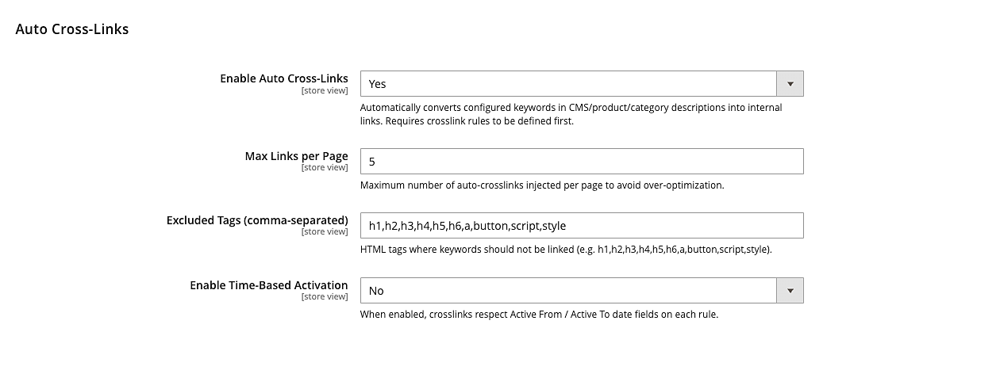

**Rules grid** — list every crosslink rule with keyword, reference type, target URL, placement toggles, store scope, schedule, and priority. Supports filters, mass actions, and inline store column resolution (`All Store Views` / `Main Website → Default Store View`).

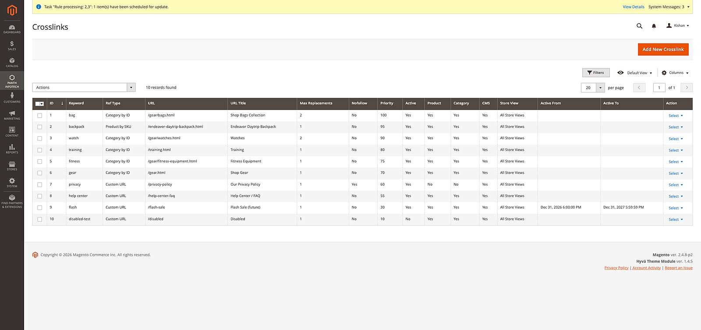

**Edit form — Category reference (all stores)** — link the keyword "bag" to Category by ID 4. Max Replacements = 2, Priority = 100, applies to product + category + CMS pages.

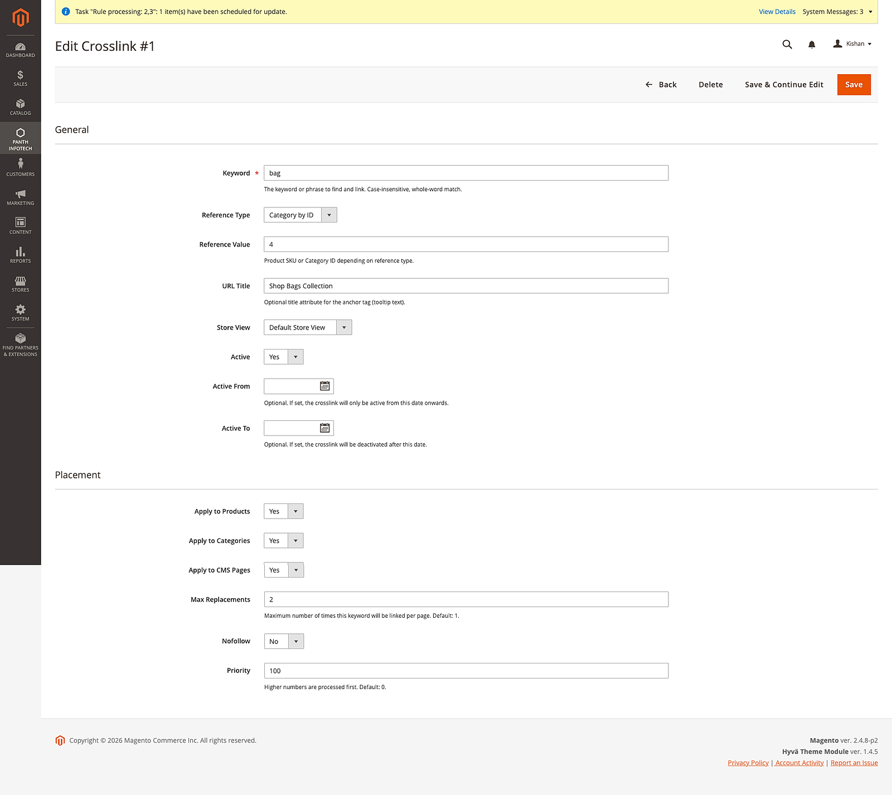

**Edit form — Scheduled Custom URL** — Flash Sale rule active only between 01 Jan 2027 → 31 Dec 2027. Respects the store-level Time-Based Activation toggle.

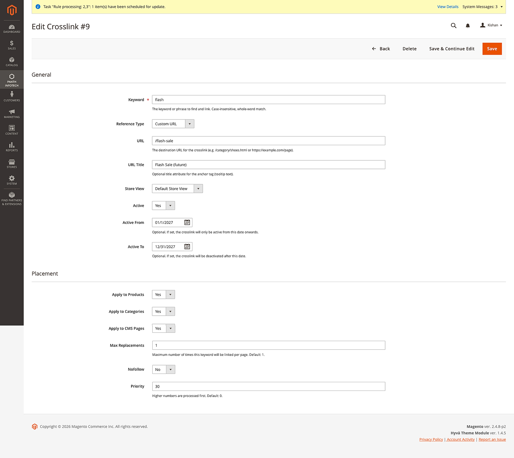

### Storefront — Hyvä

**Product description (Affirm Water Bottle)** — `backpack` → Endeavor Daytrip Backpack SKU, `bag` → Bags category. Injected inline with the `panth-crosslink` class.

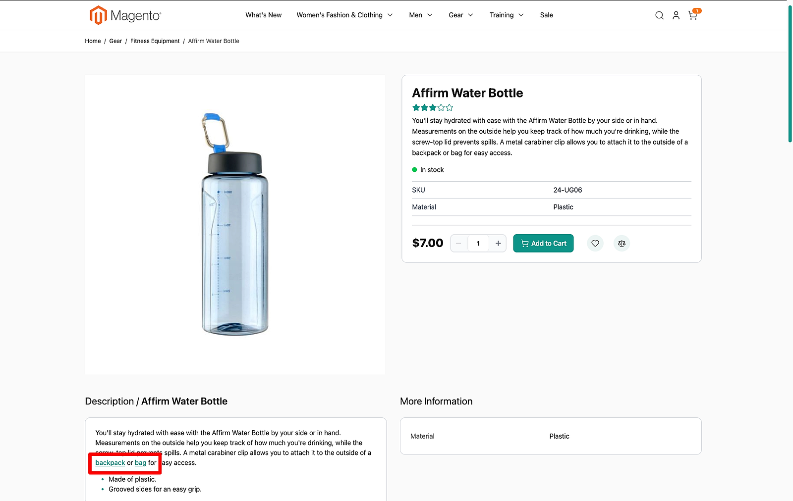

**Product description (Zing Jump Rope)** — `fitness` → Fitness Equipment category.

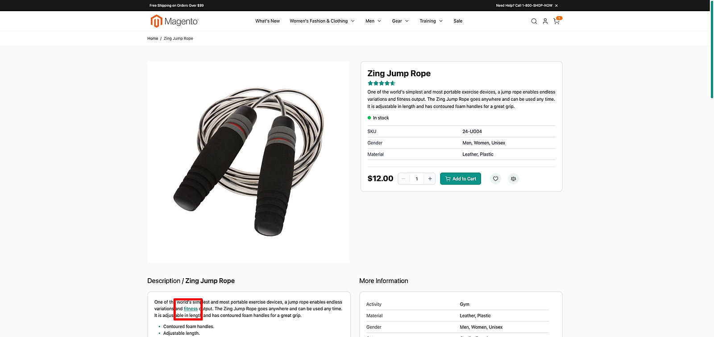

**Category description (Bags)** — `backpack`, `training`, `gear`, `bag`, `watch` rendered in the category intro.

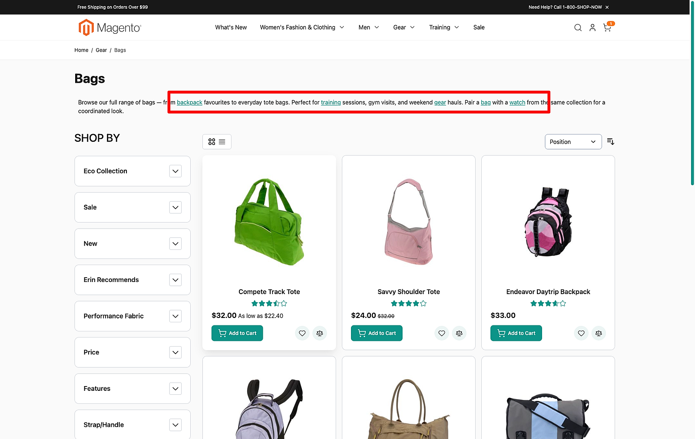

**CMS page (`/crosslink-test`)** — links for every seeded keyword in a single paragraph, capped by `max_links_per_page`.

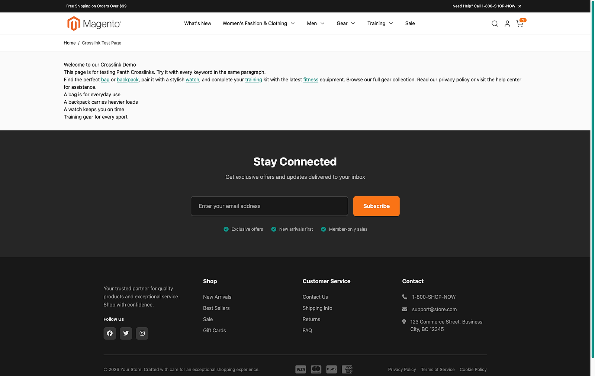

### Storefront — Luma

**Product description (Affirm Water Bottle)** — same rules render identically on Luma's default template.

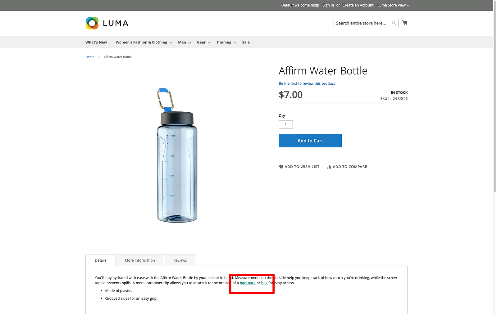

**Product description (Zing Jump Rope)** — `fitness` → Fitness Equipment category.

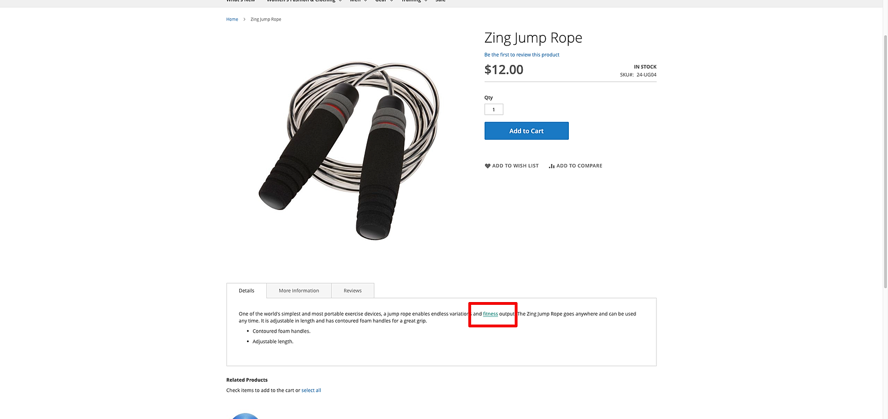

**Category description (Bags)** — `backpack`, `training`, `gear`, `bag`, `watch` rendered on the category intro.

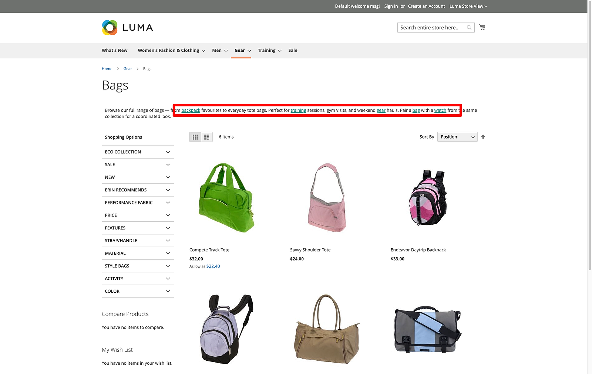

**CMS page (`/crosslink-test`)** — rules rendered via the CMS `FilterProvider` plugin on both block and page filters.

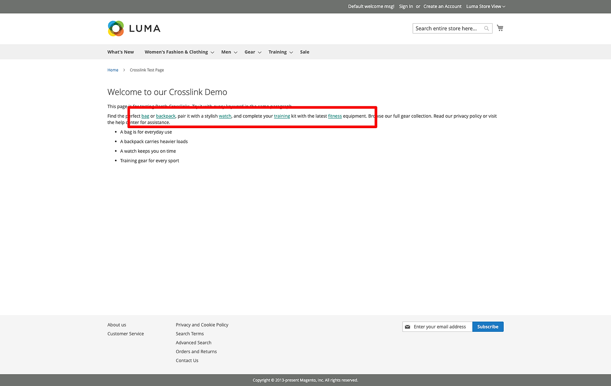

---

## Features

| Feature | Description |
|---|---|
| **Keyword-to-anchor replacement** | Case-insensitive, whole-word match. Inject into product descriptions, short descriptions, category descriptions, CMS pages, and CMS blocks. |
| **Three reference types** | `url` (direct URL), `product_sku` (resolved via `url_rewrite`), `category_id` (resolved via `url_rewrite`). SKU and category references are looked up once per request and cached. |
| **Excluded tags** | Keywords inside `<h1>`–`<h6>`, `<a>`, `<button>`, `<script>`, and `<style>` are never touched. Configurable. |
| **Per-keyword `max_replacements`** | Cap how many times each rule fires across a single rendered page. |
| **Per-page `max_links_per_page`** | Global ceiling to avoid over-optimisation. |
| **Time-based activation** | Optional `active_from` / `active_to` gating per rule when the store-level toggle is enabled. |
| **Store-scoped** | `store_id = 0` rules apply everywhere; non-zero rules are scoped to a specific store view. |
| **Priority** | Higher-priority rules are processed first, so important keywords win the link budget. |
| **Nofollow** | Per-rule toggle to add `rel="nofollow"` to the rendered anchor. |
| **URL Title** | Optional `title` attribute on the rendered anchor. |
| **Mass actions** | Enable, disable, or delete many rules at once from the admin grid. |
| **Safe rendering** | Dangerous URL schemes (`javascript:`, `data:`, `vbscript:`, `file:`) are rejected at render time even if the row somehow got into the database. |

---

## How It Works

Six small pieces cooperate:

1. **Admin grid** at `panth_crosslinks/crosslink/index` — standard Magento 2 UI component listing backed by the `panth_seo_crosslink` table.
2. **Admin form** at `panth_crosslinks/crosslink/edit/id/<ID>` — reference-type switcher hides/shows the URL vs Reference-Value input depending on the selection.
3. **`ReplacementService`** — HTML-aware engine. Splits the incoming markup into *text segments*, *tag segments*, and *excluded-tag blocks* so keywords inside headings, anchors, buttons, scripts, and styles are never touched.
4. **`CatalogOutputPlugin`** — after-plugin on `Magento\Catalog\Helper\Output::productAttribute/categoryAttribute` — fires on `description` and `short_description` (product) and `description` (category).
5. **`CmsFilterPlugin` + `CrosslinkFilterDecorator`** — wraps the CMS template filter returned by `FilterProvider` so `filter()` runs the replacement engine *after* Magento has processed widgets and directives.
6. **Master switch + config** — admin toggles live at `panth_crosslinks/general/*` and are read per-store through a thin `Helper\Config` façade.

---

## Compatibility

| Requirement | Supported |
|---|---|
| Magento Open Source | 2.4.4, 2.4.5, 2.4.6, 2.4.7, 2.4.8 |
| Adobe Commerce | 2.4.4 — 2.4.8 |
| PHP | 8.1, 8.2, 8.3, 8.4 |
| Hyva Theme | 1.0+ (fully compatible) |
| Luma Theme | Native support |
| Panth Core | ^1.0 (installed automatically) |

---

## Installation

```bash
composer require mage2kishan/module-crosslinks
bin/magento module:enable Panth_Core Panth_Crosslinks
bin/magento setup:upgrade
bin/magento setup:di:compile
bin/magento cache:flush
```

### Verify

```bash
bin/magento module:status Panth_Crosslinks
# Module is enabled
```

Visit **Admin → Panth Infotech → Crosslinks** to see the empty grid.

---

## Configuration

Navigate to **Stores → Configuration → Panth Infotech → Crosslinks**, or click **Panth Infotech → Crosslinks Configuration** in the admin sidebar.

| Setting | Default | What it controls |
|---|---|---|
| **Enable Auto Cross-Links** | Yes | Master switch. If No, no rules are injected regardless of grid state. |
| **Max Links per Page** | 5 | Global ceiling on the total number of anchor tags injected into any single rendered page. |
| **Excluded Tags** | `h1,h2,h3,h4,h5,h6,a,button,script,style` | Comma-separated list of HTML tags whose contents (including nested content) are never rewritten. |
| **Enable Time-Based Activation** | No | When Yes, each rule's `Active From` and `Active To` timestamps gate whether the rule fires. When No, those fields are ignored. |

Each setting is resolved at *store-view* scope, so you can have different link budgets and excluded tags per store.

---

## Managing Crosslink Rules

Open **Admin → Panth Infotech → Crosslinks** to reach the grid.

### Fields

| Field | Description |
|---|---|
| **Keyword** | Case-insensitive phrase the engine searches for. Whole-word boundaries only. |
| **Reference Type** | `Custom URL` — use the **URL** field directly. `Product by SKU` — look up the product's storefront path. `Category by ID` — look up the category's storefront path. |
| **URL** | Used only when Reference Type = Custom URL. Accepts relative paths (`/category/shoes.html`) or absolute URLs. |
| **Reference Value** | Used for SKU or category ID. Stored as a string for SKU, parsed as `int` for category IDs. |
| **URL Title** | Optional `title` attribute on the rendered anchor. |
| **Store View** | `0` applies to all stores; any non-zero value restricts the rule to that store view. |
| **Active** | Per-row enable/disable. |
| **Active From / Active To** | Only evaluated when the store-level time-activation flag is enabled. |
| **Apply to Product / Category / CMS** | Three independent checkboxes. Rules fire only in surfaces that are checked. |
| **Max Replacements** | Per-rule cap. After N hits across the current page, the rule stops matching. |
| **Nofollow** | Adds `rel="nofollow"` to the rendered anchor. |
| **Priority** | Higher values are processed first when the per-page link budget is tight. |

### Mass actions

Select rows and choose **Enable**, **Disable**, or **Delete** from the grid mass-action menu.

---

## Security

- Admin controllers extend `Magento\Backend\App\Action`. Every CRUD path declares its own `ADMIN_RESOURCE` constant and ACL is enforced via `_isAllowed()`.
- `Save` and `MassDelete` / `MassStatus` implement `HttpPostActionInterface` — GET requests are rejected. Form-key validation runs on every POST.
- All DB writes use prepared parameters (`$adapter->update($table, $row, ['id = ?' => $id])`) — no SQL concatenation.
- The anchor builder rejects dangerous URL schemes (`javascript:`, `data:`, `vbscript:`, `file:`) at render time and runs every user-supplied field (URL, title, matched text) through `htmlspecialchars(ENT_QUOTES | ENT_HTML5)`.
- The `Save` controller validates that the keyword does not contain `<` or `>` to prevent admin users from stashing HTML into the pattern column.

---

## Troubleshooting

### No links appearing on the frontend

1. Flush caches: `bin/magento cache:flush`.
2. Confirm **Enable Auto Cross-Links** is Yes at the store-view scope you are browsing.
3. Confirm the rule's **Active** flag is Yes and its **Apply to Product / Category / CMS** checkbox matches the surface you are testing.
4. If using Time-Based Activation, check `Active From` / `Active To` cover *now*.

### A keyword is being linked inside a heading

The headings tag list (`h1`–`h6`) is in **Excluded Tags** by default. If you removed it or misspelled a tag name, add it back.

### Too many links on one page

Lower **Max Links per Page** (config) or lower a rule's **Max Replacements**.

### A product SKU or category ID resolves to an empty link

Confirm the URL rewrite exists — `select request_path from url_rewrite where entity_type='product' and entity_id=<ID> and store_id in (0, <STORE>)`. If no row exists, the rule's matched text is rendered as plain text (no broken anchor).

---

## Support

- **Agency:** [Panth Infotech on Upwork](https://www.upwork.com/agencies/1881421506131960778/)
- **Direct:** [kishansavaliya.com](https://kishansavaliya.com) — [Get a free quote](https://kishansavaliya.com/get-quote)
