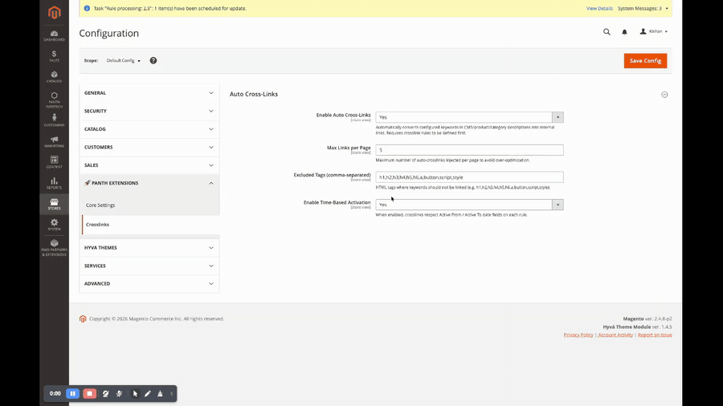
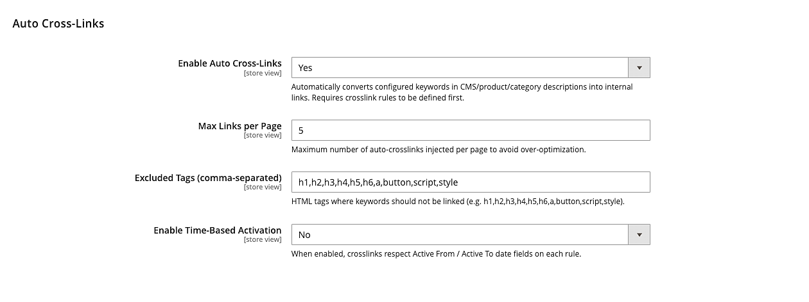
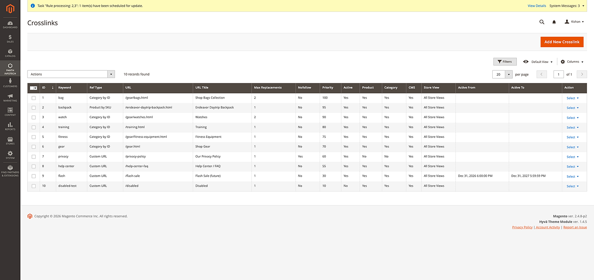
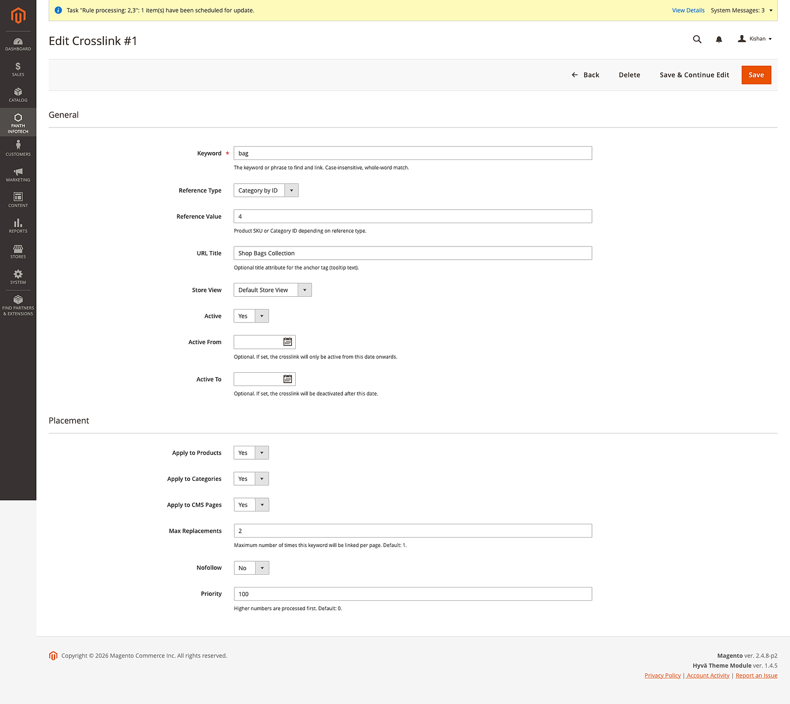
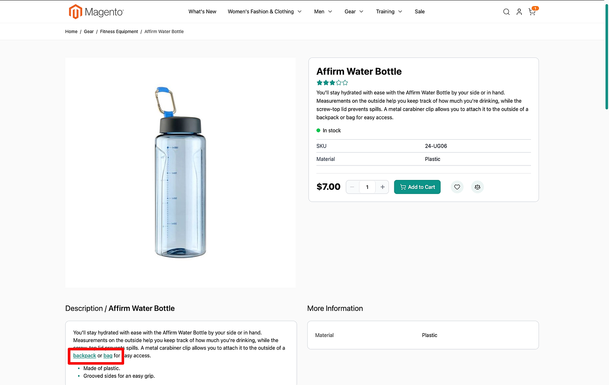
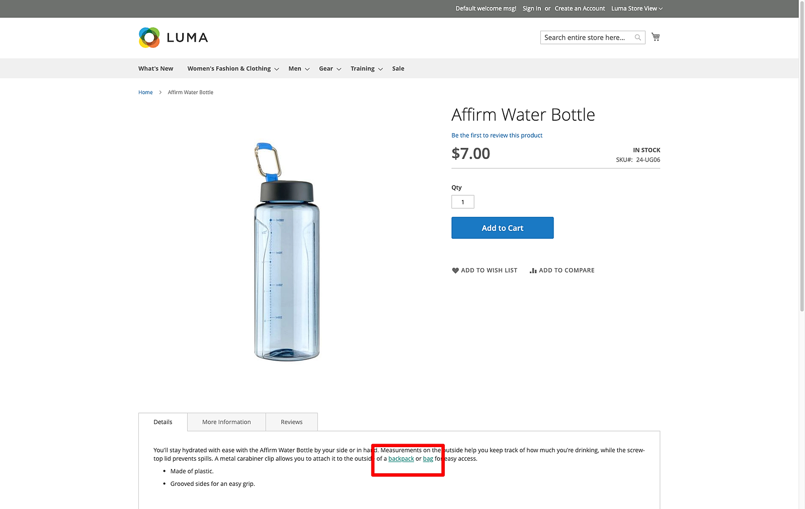

# Magento 2 Crosslinks

Panth Crosslinks turns keywords in store content into internal links. You define rules in an admin grid (a keyword plus a target: a custom URL, a product SKU, or a category ID) and the module rewrites matching words into anchor tags while Magento renders product descriptions, category descriptions, CMS pages, and CMS blocks. The original content in the database is not modified.

The replacement runs in PHP through plugins on `Magento\Catalog\Helper\Output` and `Magento\Cms\Model\Template\FilterProvider`, so it does not depend on the frontend theme. It is used by merchants and content teams who want consistent internal linking across a catalog without editing each description, and it works on both Hyva and Luma storefronts.

Product page: [kishansavaliya.com/magento-2-crosslinks.html](https://kishansavaliya.com/magento-2-crosslinks.html)



## Features

- Keyword rules managed in an admin grid with keyword search (keyword, URL, link title, reference value), filters, sorting, paging, an add/edit form, and mass actions (Enable, Disable, Delete).
- Three reference types per rule: Custom URL, Product by SKU, and Category by ID. SKU and category references are resolved to the current storefront path through the `url_rewrite` table at render time.
- Case-insensitive, whole-word keyword matching (`bag` does not match `handbag`).
- Injection into product `description` and `short_description`, category `description`, and CMS page and block content.
- Per-rule placement toggles for products, categories, and CMS content.
- Per-rule `Max Replacements` cap and a global `Max Links per Page` cap.
- Excluded HTML tags (headings, existing anchors, buttons, script, and style by default) whose contents are never rewritten; keywords inside tag attributes are never rewritten either.
- Rule priority: rules with a higher priority value are processed first.
- Store view scope per rule (`All Store Views` or a single store view).
- Optional time-based activation using `Active From` and `Active To` dates on each rule.
- Optional `rel="nofollow"` and `title` attribute per rule.
- Rules whose target resolves to the page currently being viewed are skipped, so a page does not link to itself.
- URLs using `javascript:`, `data:`, `vbscript:`, or `file:` are rejected when a rule is saved and again at render time.
- Injected anchors carry `class="panth-crosslink"`; a small CSS file with a default style is shipped and can be overridden from the theme.
- Existing rules created by Panth_AdvancedSEO in the `panth_seo_crosslink` table continue to work; no data migration is needed.

## Compatibility

| Platform | Versions |
|---|---|
| Magento Open Source | 2.4.4, 2.4.5, 2.4.6, 2.4.7, 2.4.8 |
| Adobe Commerce | 2.4.4, 2.4.5, 2.4.6, 2.4.7, 2.4.8 |
| PHP | 8.1, 8.2, 8.3, 8.4 |
| Themes | Hyva, Luma |

Composer constraints from `composer.json`: `magento/framework ^103.0`, `magento/module-backend ^102.0`, `magento/module-store ^101.0`, `magento/module-catalog ^104.0`, `magento/module-cms ^104.0`, `magento/module-ui ^101.0`.

## Requirements

- Magento Open Source or Adobe Commerce 2.4.4 to 2.4.8
- PHP 8.1, 8.2, 8.3, or 8.4
- `mage2kishan/module-core` (`^1.0`), installed automatically by Composer; it provides the `Panth Extensions` configuration tab and admin menu group
- Core Magento modules: Magento_Backend, Magento_Store, Magento_Catalog, Magento_Cms, Magento_Ui

## Installation

```bash
composer require mage2kishan/module-crosslinks
bin/magento module:enable Panth_Core Panth_Crosslinks
bin/magento setup:upgrade
bin/magento setup:di:compile
bin/magento setup:static-content:deploy -f
bin/magento cache:flush
```

`setup:di:compile` is only needed in production mode. `setup:static-content:deploy` is needed because the module ships a CSS file under `view/frontend/web/css/`.

Check that the module is enabled:

```bash
bin/magento module:status Panth_Crosslinks
```

## Configuration

Go to `Stores > Configuration > Panth Extensions > Crosslinks`, or use the `Crosslinks Configuration` entry in the Panth Extensions admin menu. All settings can be set at default, website, and store view scope.



### Auto Cross-Links

| Setting | Default | What it does |
|---|---|---|
| Enable Auto Cross-Links | Yes | Master switch. When set to No, no rules are applied anywhere. |
| Max Links per Page | 5 | Maximum number of anchors injected into one page request, counted across all processed content on that page (product descriptions, category description, CMS page and CMS blocks). Blocks served from the Magento block cache are not counted again. Shown only when the module is enabled. Values of 0 or less fall back to 5. |
| Excluded Tags (comma-separated) | h1,h2,h3,h4,h5,h6,a,button,script,style | HTML tags whose contents are left untouched. Shown only when the module is enabled. An empty value falls back to the default list. The tags a, button, iframe, noscript, object, script, select, style, svg, template, textarea and title are always excluded, whatever this setting contains. |
| Apply Limits Per | Page Request | "Page Request" counts Max Links per Page and each rule's Max Replacements across the whole page request. "Content Block" counts them separately for each processed piece of content (each description, CMS page and CMS block). Choose "Content Block" when the theme renders a description more than once and strips the tags from one copy: on Hyva product pages a stripped description excerpt is processed before the description tab, so with "Page Request" a rule with Max Replacements 1 may not appear in the visible description. Shown only when the module is enabled. |
| Enable Time-Based Activation | No | When Yes, each rule's Active From and Active To dates are checked. When No, the dates are ignored. Shown only when the module is enabled. |

Config paths:

- `panth_crosslinks/general/crosslinks_enabled`
- `panth_crosslinks/general/max_links_per_page`
- `panth_crosslinks/general/excluded_tags`
- `panth_crosslinks/general/crosslink_time_activation`
- `panth_crosslinks/general/limit_scope`

With the default values the module is active after installation, but nothing changes on the storefront until at least one rule exists.

### Crosslink rules

Rules are managed at `Panth Extensions > Crosslinks` in the admin menu (route `panth_crosslinks/crosslink/index`).



Each rule has the following fields:

| Field | Description |
|---|---|
| Keyword | Required. The word or phrase to link. Matching is case-insensitive and whole-word. Angle brackets are not allowed. |
| Reference Type | Custom URL, Product by SKU, or Category by ID. |
| URL | Required for Custom URL. Relative path (`/gear/bags.html`) or absolute URL. Only relative URLs and the http, https, mailto and tel schemes are accepted; other schemes, control characters and backslashes are rejected on save and skipped on output. |
| Reference Value | Required for Product by SKU (the SKU) and Category by ID (the category ID). |
| URL Title | Optional `title` attribute for the anchor. |
| Store View | All Store Views (0, the default for new rules) or a single store view. |
| Active | Enables or disables the rule. |
| Active From / Active To | Optional dates picked in the admin date picker and stored as calendar dates; only checked when time-based activation is enabled. Active To must not be earlier than Active From. |
| Apply to Products / Categories / CMS Pages | Placement toggles. The CMS toggle covers both CMS pages and CMS blocks. |
| Max Replacements | How many times this rule may fire on one page request. Minimum 1. |
| Nofollow | Adds `rel="nofollow"` to the anchor. |
| Priority | Higher numbers are processed first. Default 0. |



If a save is rejected (for example an unsupported URL scheme), the form reopens with the values you entered and the error message. Saving, deleting, enabling or disabling rules marks the Page Cache and Blocks HTML output cache types as invalidated, so Magento shows its usual notice and the storefront picks up the change after you refresh those cache types in `System > Cache Management`.

## Usage

Once the module is enabled and rules exist, linking happens automatically during page rendering. There is nothing to run on a schedule and no console command.

- Product pages: `description` and `short_description` output through `Magento\Catalog\Helper\Output::productAttribute()` is processed with placement `product`.
- Category pages: `description` output through `Magento\Catalog\Helper\Output::categoryAttribute()` is processed with placement `category`.
- CMS pages and blocks: the page filter and block filter returned by `Magento\Cms\Model\Template\FilterProvider` are wrapped so the replacement runs after Magento has processed directives and widgets, with placement `cms`.

For each processed piece of content the module loads the active rules for the current store view (rules scoped to All Store Views plus rules for that store view) that match the placement, orders them by priority, and applies them to text nodes only. Tag attributes, comments and HTML entities are never modified. Matches are first replaced with placeholder tokens and swapped for the final anchors at the end, so a link inserted by one rule is never matched again by a later rule.

Anchors look like this:

```html
<a href="/gear/bags.html" class="panth-crosslink" title="Bags" rel="nofollow">bag</a>
```

The default style is in `view/frontend/web/css/crosslinks.css`, which is added to every frontend page through `view/frontend/layout/default.xml`. Override `a.panth-crosslink` in the theme to change it.

Storefront results on Hyva and Luma:





## Developer Notes

- Module name: `Panth_Crosslinks`
- Composer package: `mage2kishan/module-crosslinks`
- Namespace: `Panth\Crosslinks`
- Sequence: loads after `Panth_Core`, Magento_Backend, Magento_Store, Magento_Catalog, Magento_Cms, Magento_Ui

Key classes:

- `Model\Crosslink\ReplacementService::processContent(string $html, string $pageType, int $storeId): string` does the matching and anchor building. Page types are `product`, `category`, and `cms`.
- `Plugin\Crosslink\CatalogOutputPlugin` (after-plugins on `productAttribute` and `categoryAttribute` of `Magento\Catalog\Helper\Output`).
- `Plugin\Crosslink\CmsFilterPlugin` (after-plugins on `getPageFilter` and `getBlockFilter` of `Magento\Cms\Model\Template\FilterProvider`) and `Plugin\Crosslink\CrosslinkFilterDecorator`, which wraps the filter and processes the output of `filter()`. Fluent calls such as `setStoreId()` return the wrapper, so `getBlockFilter()->setStoreId($id)->filter($html)` (used by `Magento\Cms\Block\Block` and the CMS Static Block widget) is processed too.
- `Helper\Config` exposes `isEnabled()`, `getMaxLinksPerPage()`, `getExcludedTags()`, `isTimeActivationEnabled()`, and `isLimitPerContent()`, all at store view scope.
- `Model\Crosslink\Crosslink` (model), `Model\ResourceModel\Crosslink` and `Model\ResourceModel\Crosslink\Collection` (resource and collection), `Model\ResourceModel\Crosslink\Grid\Collection` (grid data source `panth_crosslink_listing_data_source`).
- `Model\Config\Source\CrosslinkReferenceType` defines the constants `url`, `product_sku`, and `category_id`.
- `Api\CrosslinkRepositoryInterface` with a preference to `Model\Crosslink\Repository`; `getById()` and `deleteById()` read and delete rows directly, while `save()` inserts or updates the row (from a model or an array) and returns the entity with `crosslink_id` set.
- Admin controllers under `Controller\Adminhtml\Crosslink` (`Index`, `NewAction`, `Edit`, `Save`, `Delete`, `MassDelete`, `MassStatus`) on the `panth_crosslinks` admin route. `Delete`, `Save`, `MassDelete` and `MassStatus` accept POST only. Saving writes directly to the table with `ResourceConnection`.
- UI components: `panth_crosslink_listing` (grid) and `panth_crosslink_form` (form).

ACL resources:

- `Panth_Crosslinks::manage` (Crosslinks, under `Panth_Core::panth_extensions`)
- `Panth_Crosslinks::crosslinks` (Manage Crosslinks; used by all admin controllers)
- `Panth_Crosslinks::config` (Panth Crosslinks Configuration)

Database table (`etc/db_schema.xml`): `panth_seo_crosslink` with columns `crosslink_id`, `keyword`, `url`, `url_title`, `max_replacements`, `nofollow`, `priority`, `is_active`, `in_product`, `in_category`, `in_cms`, `store_id`, `created_at`, `active_from`, `active_to`, `reference_type`, `reference_value`, and an index on `is_active, store_id`. The table name is kept from Panth_AdvancedSEO on purpose.

The module declares no events, observers, cron jobs, web API routes, frontend routes, or console commands.

## Uninstallation

```bash
bin/magento module:disable Panth_Crosslinks
composer remove mage2kishan/module-crosslinks
bin/magento setup:upgrade
bin/magento setup:di:compile
bin/magento cache:flush
```

The `panth_seo_crosslink` table and the `panth_crosslinks/*` values in `core_config_data` are not removed automatically. Drop the table and delete the config rows manually if they are no longer needed. Keep the table if Panth_AdvancedSEO still uses it.

## Support

- Product page: [kishansavaliya.com/magento-2-crosslinks.html](https://kishansavaliya.com/magento-2-crosslinks.html)
- Contact: [kishansavaliya.com/contact](https://kishansavaliya.com/contact)
- Email: kishansavaliyakb@gmail.com
- GitHub issues: [github.com/mage2sk/module-crosslinks/issues](https://github.com/mage2sk/module-crosslinks/issues)

## License

Proprietary, as declared in `composer.json`. The package is published on Packagist and can be installed with Composer; see the product page for the terms of use.

## Changelog

See [CHANGELOG.md](CHANGELOG.md).

## Links

- Website: [kishansavaliya.com](https://kishansavaliya.com)
- All extensions: [kishansavaliya.com/magento-extensions.html](https://kishansavaliya.com/magento-extensions.html)
- GitHub: [github.com/mage2sk/module-crosslinks](https://github.com/mage2sk/module-crosslinks)
- Packagist: [packagist.org/packages/mage2kishan/module-crosslinks](https://packagist.org/packages/mage2kishan/module-crosslinks)
